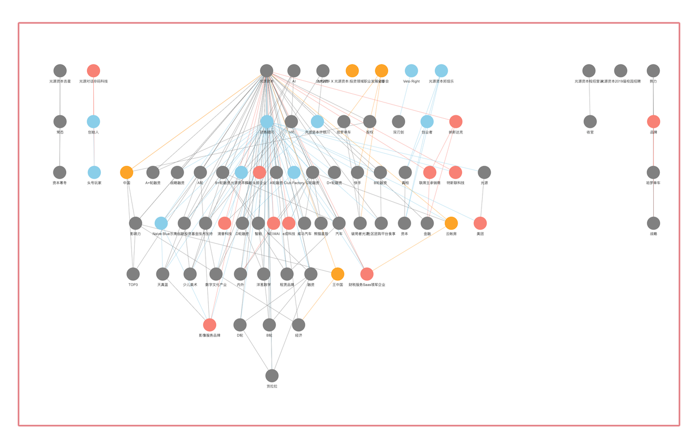
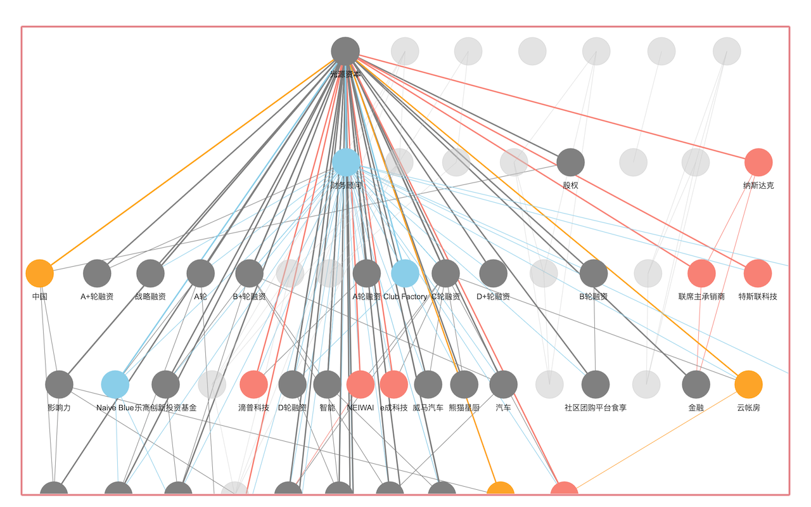

# Knowledge Graph Demo

## Definition

There is no clear definition for the term `knowledge graph`. It is made well-known by Google with its initiative by the same name in 2012. Very often, people use the term to represent [ontology](https://en.wikipedia.org/wiki/Ontology_(information_science)) in general. In some contexts, the term is used to refer to **any knowledge base that is represented as a graph**.

## About This Repository

A demonstration of using publicly available data to create a simple knowledge graph. To be more precise, we do **[entity](https://en.wikipedia.org/wiki/Entity_class) analysis based on articles published by our main interest (query) to form a network [graph](https://en.wikipedia.org/wiki/Graph_theory) in order to organize information into [knowledge](https://en.wikipedia.org/wiki/Knowledge) (understanding).**

The general idea is as follows,

1. Find an information source
2. Extract data
3. Do entities analysis
4. Plot network graph

We use data extracted from [Zhihu.com](https://www.zhihu.com/) (知乎), a platfrom of information sharing and article publishing in China.

## Configuration

Configuration (`config.yml`) is imported through package [config](https://cran.r-project.org/web/packages/config/index.html). Sample file is provided. 

## Example

Knowledge graph of **Lighthouse Capital (光源资本)**

